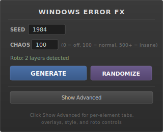
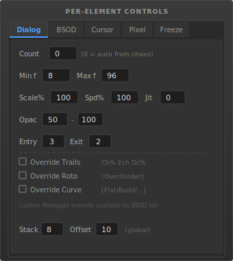
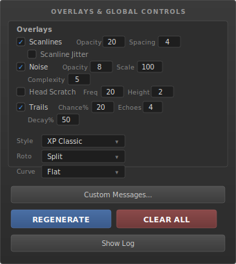

# Windows Error FX

A ScriptUI panel for Adobe After Effects that generates Windows 9x/XP error aesthetic effects over your footage. One file, no plugins, no assets.

---

## What It Does

Generates Windows error dialogs, BSOD panels, corrupted text, cursor artifacts, pixel corruption, and freeze strips over your footage. Dialogs use pre-rendered PNGs (embedded in the script) for fast generation with pixel-perfect title bar gradients. All other elements are native AE shape/text layers. Everything composites over (and optionally behind) your footage using auto-detected or explicitly chosen roto layers.

- **Seeded randomness** — same seed always produces the same layout
- **Chaos slider** — controls density from subtle glitches to total system failure
- **Per-element control** — independent settings for each element type, including jitter
- **Roto-aware** — auto-detects or lets you pick the roto layer, with adjustable over/under split
- **Custom assets** — supply your own dialog/cursor PNGs via a project bin folder
- **Fully editable** — output is normal AE layers, not baked pixels

## Install

1. Copy `WindowsErrorFX.jsx` into your ScriptUI Panels folder:

   **Windows:** `C:\Program Files\Adobe\Adobe After Effects <version>\Support Files\Scripts\ScriptUI Panels\`

   **Mac:** `/Applications/Adobe After Effects <version>/Scripts/ScriptUI Panels/`

2. Restart After Effects.

3. Open via **Window > Windows Error FX**.

> First time? Enable scripting: **Edit > Preferences > Scripting & Expressions** > check **Allow Scripts to Write Files and Access Network**.

## Quick Start

1. Open a comp with your footage.
2. Open the **Windows Error FX** panel.
3. Enter a **seed** (or hit **RANDOMIZE** for a full random setup).
4. Set **chaos** (start around 50-100).
5. Hit **GENERATE**.

A pre-comp with error windows, BSOD panels, cursors, glitch text, pixel corruption, and freeze strips appears in your comp. Change the seed for a different look. Same seed = same result every time.

## Panel Layout

### Main Panel

  

Enter a seed, set your chaos level, choose a roto layer (or leave on **Auto-detect**), and hit **GENERATE**. The **RANDOMIZE** button randomizes all settings at once — seed, chaos, per-element controls, overlays, style, and curve — for quick experimentation.

### Per-Element Tabs

  

A tabbed panel gives independent control over each of the 6 element types (Dialog, BSOD, Cursor, Pixel, Freeze). Each tab has:

| Field | What it does |
|---|---|
| **Count** | Exact number to spawn (0 = auto from chaos level) |
| **Min / Max f** | Duration range in frames |
| **Scale %** | Size multiplier |
| **Spd %** | Animation speed multiplier |
| **Jit** | Position jitter intensity (0 = off, higher = more wiggle) |
| **Opac** | Opacity range (min - max) |
| **Entry / Exit** | Fade-in and fade-out frames |

Stack Depth and Offset (for dialog cascade stacking) remain global controls below the tabs.

### Overlays & Global Controls

  

| Control | What it does |
|---|---|
| **Scanlines** | CRT scanline overlay with opacity, spacing, and jitter |
| **Noise** | Fractal noise grain overlay |
| **Head Scratch** | Horizontal line artifacts |
| **Trails** | Echo/ghost trail effect on random elements |
| **Style** | Animation personality: XP Classic, Glitch Heavy, Slow Burn, Chaos Maximum |
| **Roto** | How elements interact with roto layers (Split / All Over / All Under / Flat) |
| **Behind %** | Probability of elements going behind the roto subject (0 = all over, 100 = all under) |
| **Curve** | Time distribution: Flat, Build, Peak, Burst, Random |
| **Custom Messages** | Add your own error messages (applies to BSOD and text elements) |
| **Export Assets** | Decode built-in PNGs into a project folder for customization |
| **REGENERATE** | Replaces existing effect without confirmation |
| **CLEAR ALL** | Removes all generated elements |
| **Show Log** | View the generation log file for debugging |

## Roto Layers

Use the **Roto** dropdown in the main panel to explicitly select a roto layer, or leave it on **Auto-detect** to find layers by name. Auto-detect looks for names containing **roto**, **matte**, **cutout**, **subject**, or **fg**. In **Split** mode, the **Behind %** slider controls how often elements go behind vs. in front of your subject. No roto layers? Everything composites flat.

## Logging

Each generate writes a log to `Documents/WindowsErrorFX/WindowsErrorFX.log`. The file is overwritten each run and is safe to delete. Use the **Show Log** button to view it, reveal it in Explorer/Finder, or delete it.

---

<strong>Seed &amp; Determinism</strong>

Every generated layout is driven by a single integer **seed**. The same seed with the same settings always produces the exact same arrangement of error windows, BSOD panels, text, cursors, pixel blocks, and freeze strips.

- Change the seed to get a completely different layout
- Write down a seed you like — you can recreate it any time
- **RANDOMIZE** picks a new seed *and* randomizes all settings at once

<strong>Chaos Level</strong>

Chaos controls how many elements are generated (when per-element counts are set to 0/auto).

| Range | Feel |
|---|---|
| 0 | Nothing generated |
| 1–50 | Subtle — a few scattered elements |
| 50–150 | Normal — a healthy amount of error chaos |
| 150–300 | Heavy — screen fills up fast |
| 300+ | Insane — hundreds of overlapping elements |

The formula is non-linear (power curve), so low values stay subtle and high values escalate dramatically.

<strong>Per-Element Tabs</strong>

Five tabs (Dialog, BSOD, Cursor, Pixel, Freeze) give you independent control over each element type (Text elements use global settings):

- **Count** — Exact number to spawn. Set to `0` for auto (chaos-based). Example: set Dialog to 5, Cursor to 0, and everything else to 0 to get only 5 error windows.
- **Min / Max f** — Duration range in frames. Elements will last between these values.
- **Scale %** — Size multiplier. 100 = normal, 200 = double size.
- **Spd %** — Animation speed. 100 = normal, 50 = half speed, 200 = double speed.
- **Jit** — Position jitter. 0 = off, 50 = subtle oscillation, 100+ = aggressive shaking. Adds a `wiggle()` expression to the element's position.
- **Opac** — Opacity range. Elements get a random opacity between min and max.
- **Entry / Exit** — Fade-in and fade-out duration in frames.

**Per-element overrides** (below the main fields in each tab):
- **Override Trails** — Set trails (echo effect) independently for this element type. Unchecked = use global trails setting.
- **Override Roto** — Force this element type to always appear Over or Under the roto subject, regardless of the global roto mode.
- **Override Curve** — Use a different time distribution curve for this element type.
- **Custom Messages** — (BSOD only) Set custom error text specific to this element type. Dialog text is baked into pre-rendered images.

<strong>Animation Style</strong>

The Style dropdown changes the personality of element animations:

- **XP Classic** — Balanced mix of behaviors, moderate timing
- **Glitch Heavy** — More shaking, jump-cuts, and erratic movement
- **Slow Burn** — Longer durations, more static/drifting, gradual buildup
- **Chaos Maximum** — Short durations, rapid-fire, maximum visual noise

<strong>Chaos Curve</strong>

Controls *when* elements appear across your timeline:

- **Flat** — Evenly distributed throughout the comp
- **Build** — Sparse at the start, dense toward the end (ramps up)
- **Peak** — Clustered in the middle, sparse at edges (bell curve)
- **Burst** — Random clusters of activity with gaps between
- **Random** — Weighted random segments of varying density

Per-element curve overrides let different types follow different distributions (e.g., dialogs build up while BSOD panels appear flat).

<strong>Roto Mode</strong>

Controls how elements interact with your roto subject:

- **Split** — Elements randomly appear above and below the subject. The **Behind %** slider controls the probability (0% = all in front, 50% = even split, 100% = all behind)
- **All Over** — Everything composites in front of the subject
- **All Under** — Everything composites behind the subject
- **Flat** — No roto splitting; everything in one layer (use when you have no roto layers)

The **Roto** dropdown in the main panel lets you pick a specific layer instead of relying on auto-detection. Per-element roto overrides let you force specific types over or under regardless of the global mode.

<strong>Overlays</strong>

- **Scanlines** — CRT-style horizontal line overlay. Adjust opacity, line spacing, and enable jitter for randomized line positions.
- **Noise** — Fractal noise grain overlay. Control opacity, scale (grain size), and complexity (detail level).
- **Head Scratch** — Horizontal line artifacts that appear at random positions, like a damaged VHS tape.

<strong>Trails</strong>

Trails add an echo/ghost effect to random elements using AE's Echo effect.

- **Chance %** — Probability that any given element gets trails (e.g., 20 = 1 in 5 elements)
- **Echoes** — Number of trailing copies
- **Decay %** — How quickly each echo fades (higher = faster fade)

Per-element trail overrides let you give specific types their own trail settings (or disable trails entirely for a type while keeping them globally on).

<strong>Custom Messages</strong>

Add your own error messages via the **Custom Messages** button. Messages are mixed into the random pool for BSOD and text elements — the more you add, the more often they appear.

- **Global custom messages** apply to BSOD and text elements
- **Per-element custom messages** (via the Override checkbox in the BSOD tab) apply only to BSOD and override the global pool

Dialog text is pre-rendered into embedded PNG images and cannot be customized via text. However, you can supply your own dialog PNGs via the custom assets folder (see below).

<strong>Custom Assets</strong>

You can replace or supplement the built-in dialog and cursor images with your own PNGs.

1. Click **Export Assets...** to decode all 38 built-in PNGs (36 dialogs + 2 cursors) into a `WindowsErrorFX_Custom` folder in your AE project bin
2. The PNGs are also written to `Documents/WindowsErrorFX/custom/` on disk — edit them in any image editor
3. Re-import your modified PNGs into the `WindowsErrorFX_Custom` folder, or add entirely new ones
4. On the next **GENERATE**, custom dialog PNGs are randomly mixed in alongside the built-in set (50/50 chance per dialog)

The custom folder is never deleted by **CLEAR ALL** — it's yours to manage. Delete `WindowsErrorFX_Custom` from the project bin to go back to built-in assets only.

## Requirements

- After Effects CC 2015 or newer
- Mac or Windows
- No plugins or fonts required (uses Courier New and Arial)

## License

MIT
